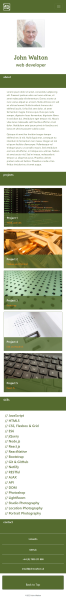
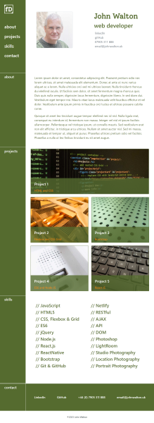
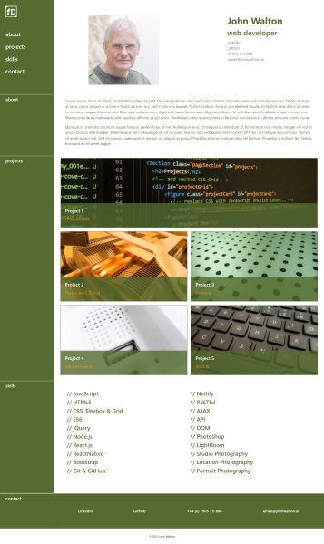

# 03 - Portfolio Bootstrap

## Description
	
HTML and CSS code has been used in combination with Bootstrap 4 to create a responsive portfolio webpage. 

&nbsp;&nbsp;&nbsp;&nbsp;&nbsp;&nbsp;&nbsp;&nbsp;&nbsp;&nbsp;&nbsp;&nbsp;&nbsp;&nbsp;&nbsp;&nbsp;

	
## Installation
	
n/a
	
## Usage
	
A live published page can be found at: https://github.com/forestDean/03-portfolio-bootstrap

Navigation links take the user to the corresponding section and Projects are displayed with placeholder image links. When the page is resized the layout will respond at the 992px, 768px and 576px breakpoints.

For the mobile layout, a 'hamburger menu' has been postioned at the top of the screen, following the Bootstrap guidelines.
	
    
To view HTML source code, right-click the webpage and select `View page source` (Windows) or select `Develop > Show Page Source` (macOS)

With [**Chrome DevTools**](https://www.google.com/intl/en_uk/chrome/dev/), by pressing `Control+Shift+I` (Windows) or `Command+Option+I` (macOS), a panel is opened allowing access to the CSS applied to the webpage.
	
## Credits
	
Bootstrap 4 - https://getbootstrap.com/docs/5.3/getting-started/introduction/

## License
	
**MIT** - Please refer to the LICENSE in the repository.
